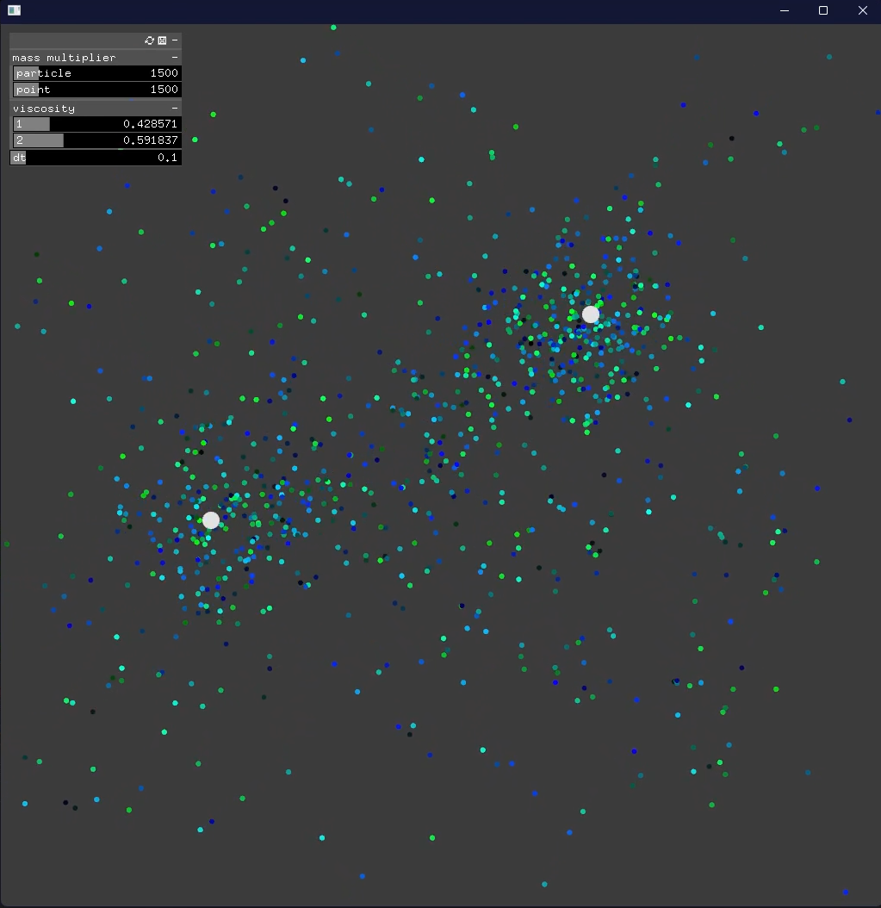

Particle System written with [OpenFrameworks](https://openframeworks.cc/) and [CUDA](https://developer.nvidia.com/cuda-toolkit)

Particles interact with the point of mass and with each other by the gravity force

All computations run on CUDA and OpenFrameworks is used for graphic

